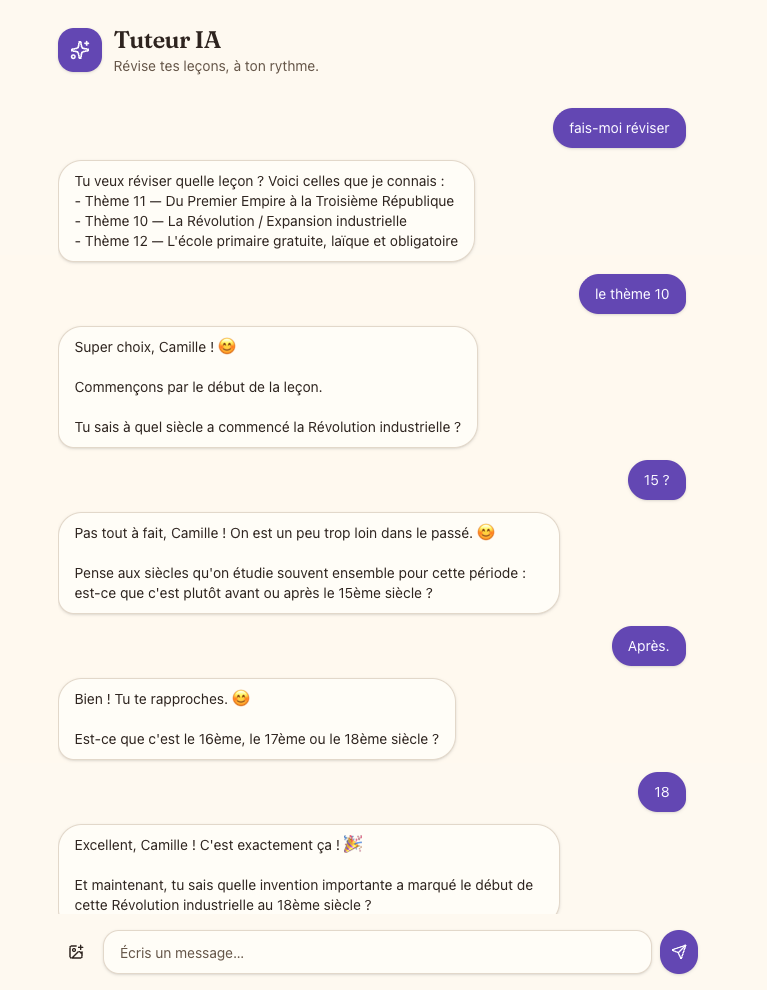

# Tuteur IA — a Socratic tutor with compounding memory

A **Socratic** AI tutor that helps a student reason their way to understanding
instead of being handed the answer. What sets it apart is a **memory that
compounds session after session** — a model of the student that is re-read and
rewritten on every review, so the tutoring gets better over time.

Built for family use: a parent account administers the install and creates one
account per child (own login, own grade level); each child has their own lesson
corpus, any school subject, and their own persistent tutoring session. A parent
view shows, per child and per lesson, which concepts are mastered vs in
progress.

In practice everything happens in **a single chat**: the student opens the app and
says "let's review lesson 13" or "I got a new lesson, take it into account," and the
system routes, questions, assesses, and remembers.

<p align="center">
  
</p>

<p align="center"><em>A real review session — the tutor clarifies which lesson, then guides instead of handing over the answer.</em></p>

> **Status:** proof of concept. The goal isn't a finished product but to demonstrate
> a **reliable agentic architecture**. Working conventions are in
> [CLAUDE.md](CLAUDE.md).

## Guiding ideas

The value of this project is in the architecture, not the framework or the UI:

- **Orchestration is deterministic code; the LLM only lives inside nodes.** A
  directed graph (LangGraph) decides *which* flow runs and *when* memory gets
  written. The LLM never orchestrates — it reasons only where reasoning is actually
  needed: classifying an intent, driving the Socratic dialogue, extracting
  structured memory operations.
- **Memory writes are deterministic.** The LLM *proposes* structured operations
  (validated with Zod); a **deterministic applier** executes them against the
  database. The golden rule: **silence is not contradiction** — a fact not
  re-observed this session is kept (NOOP), never erased. Blind overwrites are the
  silent killer of a memory that's meant to compound.
- **The right altitude per node.** The plumbing (orchestration, persistence) is
  constrained; the pedagogy (the Socratic conversation) is left open. The product's
  edge lives in how well memory is hydrated to feed the Socratic node — not in a
  "clever" prompt.

## Stack

A **pnpm workspaces + Turborepo** monorepo, Node 20.19+.

| Piece | Choice |
|---|---|
| Backend | Fastify (thin API) + **LangGraph.js** in-process |
| LLM | LangChain + Zod structured output, through a **per-role model factory** (provider-agnostic, Anthropic Claude by default) |
| Domain database | PostgreSQL via **Prisma 7** (migrations) |
| Conversation persistence | `PostgresSaver` (LangGraph checkpointer) |
| Frontend | React + Vite + Tailwind v4 + shadcn/ui, streaming via **AI SDK v6** (`useChat`) |
| Transport | a single `/api/chat` endpoint, SSE stream (`UIMessageStream`) |
| Observability / cost | OpenTelemetry → **Langfuse** (optional) |
| Eval | LLM-as-judge via Langfuse Dataset Runs |

## Memory model (the core)

Durable memory lives in Postgres, kept **separate** from chat messages (which are
ephemeral, held in the checkpointer). Two structural principles:

- **Working memory ≠ long-term memory.** A session's thread is a throwaway
  scratchpad; the student model in the database is the product. Durable memory
  **never depends on the app closing cleanly** — distillation is **incremental, per
  assessed concept** (a kid closes the app abruptly; after each resolved concept the
  memory is already up to date and consistent).
- **Current state + history.** Every mutable entity has a current-state table (read
  each session) **and** an append-only `*_history` table (audit / provenance /
  rollback). The applier writes both in **a single transaction**.

Main entities: `student`, `lesson` (plus `concept`, the teachable unit), `mastery`
(per-concept mastery overlay with Leitner-style spaced repetition), `student_profile`
(the pedagogical profile injected into the Socratic prompt), and `session_trace`.
"Unknown mastery" is simply the absence of a `mastery` row.

## Flows

A **deterministic router** (the parent graph) classifies the intent, then routes to
a subgraph:

- **`ingest`** — read lesson images (vision LLM) → structured extraction → optimistic
  persistence + a "here's what I understood" recap.
- **`revise`** — the core. A deterministic loop over prioritized concepts (gaps +
  recency); inside it, a bounded Socratic dialogue (a streamed `socratic` node + a
  structured `evaluate` node). Memory writes are *gated*: they fire only when a
  concept is resolved.
- **`out_of_scope`** — redirects off-lesson questions. The wall that keeps it from
  becoming a generic chatbot.

## Getting started

Prerequisites: Node 20.19+, pnpm, Docker.

```bash
pnpm install

# 1. Environment variables
cp apps/backend/.env.example apps/backend/.env
#   → set ANTHROPIC_API_KEY (Langfuse is optional)

# 2. Database
docker compose up -d postgres
pnpm --filter @tuteur/backend db:migrate

# 3. Run backend (:3001) + frontend (:5173)
pnpm dev
```

> The Prisma 7 client is generated (gitignored) into `apps/backend/src/generated`:
> run `db:migrate` or `db:generate` before `typecheck`/`build` on a fresh checkout.

## Commands

| Command | What it does |
|---|---|
| `pnpm dev` | backend + frontend together |
| `pnpm build` / `pnpm typecheck` | all packages |
| `pnpm test` | tests (Postgres required; provisions a dedicated `tuteur_test` database) |
| `pnpm --filter @tuteur/backend eval` | LLM-as-judge eval via Langfuse |

## Production images

The root `Dockerfile` exposes three independently buildable targets:

```bash
docker build --target migrate -t tuteur-ia-migrate .
docker build --target backend -t tuteur-ia-backend .
docker build --target frontend -t tuteur-ia-frontend .
```

`backend` runs Fastify as the unprivileged Node user on port `3001` and defaults
`INGEST_UPLOAD_DIR` to `/data/uploads`. Production must mount that path on a
persistent volume. `frontend` runs unprivileged Nginx on port `8080`, serves the
Vite build, falls back to `index.html` for client routes, and proxies `/api/*`
and `/health` to `backend:3001`. Only the frontend is intended for an external
domain; neither Docker target publishes a host port by itself.

`docker-compose.production.yml` assembles these two targets. It declares no
host port, custom network, or PostgreSQL container. The deployment platform
must inject `DATABASE_URL`, `AUTH_SECRET`, and `ANTHROPIC_API_KEY`; lesson
images are persisted in the named volume mounted at `/data/uploads`.

## Production deployment

Pushes to `main` are deployed by [`.github/workflows/deploy.yml`](.github/workflows/deploy.yml).
The workflow exchanges GitHub's OIDC identity for a short-lived Tailscale
identity, reaches the private Coolify control plane, and deploys two resources
sequentially:

1. the one-shot migration resource, which applies Prisma migrations and
   initializes the LangGraph checkpointer;
2. the frontend/backend runtime, triggered only after the migration resource
   succeeds.

Both deployments must finish on the exact SHA that triggered the workflow.
Production credentials stay in the protected GitHub environment and Coolify;
they are never stored in this repository.

## Repo layout

```
apps/
  backend/    # Fastify + LangGraph: graphs/, memory/, llm/, eval/, observability/
  frontend/   # React + Vite: parts-based chat, ConfirmCard (HIL)
packages/
  shared/     # shared TS contracts (typed messages, intents, memory types)
```

## Tests

Vitest, with co-located `*.test.ts` files. The approach is **functional core /
imperative shell**: the memory policy (the dense, risky code) is a *pure* decision
tested exhaustively with no database; the transactional shell is integration-tested
against a real Postgres. The database is **never mocked** — correctness here lives in
the actual SQL (anti-joins, transactions, merge-not-overwrite).

## License

[MIT](LICENSE) © 2026 Kajan Siva
